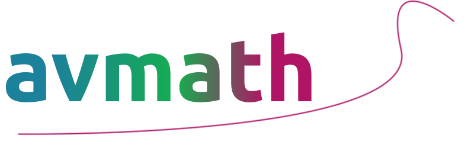

---

_Avmath_ is a python library for mathematics. 

---
## Contents

* [Description](#description)
* [Features](https://github.com/ballandt/avmath/wiki#features)
* [Installation](https://github.com/ballandt/avmath/wiki/Documentation#installation)
* [Documentation](https://github.com/ballandt/avmath/wiki/Documentation)
* [Changelog](https://github.com/ballandt/avmath/blob/master/CHANGELOG.md)
* [Developments](https://github.com/ballandt/avmath/wiki#developments)
* [Releases](https://www.github.com/ballandt/avmath/releases)
---

## Information

| Category           | Data                                                                 |
|--------------------|----------------------------------------------------------------------|
| Name               | avmath                                                               |
| PyPi name          | [avmath](https://pypi.org/project/avmath/)                           |
| Author             | Camillo Ballandt                                                     |
| Release version    | [3.1.0](https://www.github.com/ballandt/avmath/releases/tag/v3.1.0)  |
| Developing version | [Developments](https://github.com/ballandt/avmath/wiki/Developments) |
| Requirements       | Python 3.10                                                          |

---
## Description

Avmath is a library project that uses python algorithms to numerically solve
math problems. Its interface is based on mathematical habits of
writing. It particularly concentrates on the concepts of linear algebra
and analysis, but also generates its own functions based on Taylor-series.
For further description, see the [wiki](https://github.com/ballandt/avmath/wiki).